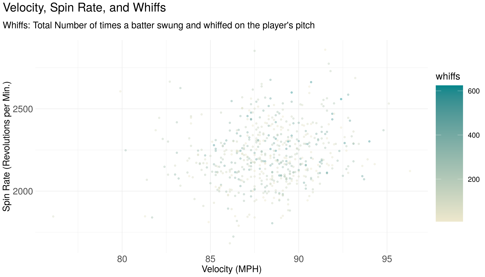

<!-- README.md is generated from README.Rmd. Please edit that file -->

# pitchR 

<!-- badges: start -->

<!-- badges: end -->

The goal of `pitchR` is to provide an accessible dataset with advanced
pitching statistics and salary data for individual starting pitchers.
This dataset contains data from the 2018, 2019, and 2020 seasons.

One exciting feature of the package is the inclusion of expected
statistics:


## Installation

The development version of pitchR is available from
[GitHub](https://github.com/) with:

``` r
# install.packages("devtools")
devtools::install_github("Reed-Math241/pkgDemo")
```

## About the Data

Data were collected and made available by
[Spotrac](https://www.spotrac.com/mlb/payroll/) and the
[Savant](https://baseballsavant.mlb.com/statcast_search). The full
scraping and cleaning process is documented
[here](https://github.com/Reed-Math241/pkgGrpq/blob/master/data-raw/DATASET.R).

The `pitchR` package contains one dataset, with data on Pitchers from
the 2018-2020 Seasons.

``` r
library(pitchR)
data('pitchR')
```

Here is a simplified version of the raw data; see `?pitchR` for more
info:

``` r
head(pitchR)
#> # A tibble: 6 x 23
#>   name  salary pitches player_id  year    ba   iso babip   slg  woba xwoba   xba
#>   <chr>  <dbl>   <dbl>     <dbl> <dbl> <dbl> <dbl> <dbl> <dbl> <dbl> <dbl> <dbl>
#> 1 Clay… 3.56e7    2364    477132  2018 0.227 0.139 0.276 0.366 0.272 0.285 0.24 
#> 2 Rich… 1.67e7    2104    448179  2018 0.219 0.181 0.272 0.4   0.297 0.309 0.229
#> 3 Kent… 6.12e6    2051    628317  2018 0.24  0.159 0.323 0.399 0.304 0.292 0.225
#> 4 Alex… 6.00e6    2443    622072  2018 0.247 0.116 0.295 0.363 0.288 0.295 0.244
#> 5 Ross… 5.55e5    1999    548389  2018 0.257 0.174 0.324 0.431 0.309 0.272 0.223
#> 6 Masa… 2.20e7    2398    547888  2018 0.24  0.182 0.286 0.422 0.307 0.311 0.247
#> # … with 11 more variables: hits <dbl>, abs <dbl>, launch_speed <dbl>,
#> #   launch_angle <dbl>, spin_rate <dbl>, velocity <dbl>, effective_speed <dbl>,
#> #   whiffs <dbl>, swings <dbl>, takes <dbl>, release_extension <dbl>
```

## Examples

Pitchers are fun to summarize\! For example:

``` r
library(tidyverse)

pitchR %>% 
  count(year)
#> # A tibble: 3 x 2
#>    year     n
#>   <dbl> <int>
#> 1  2018   226
#> 2  2019   185
#> 3  2020   161

pitchR %>% 
  group_by(year) %>% 
  summarize(across(where(is.numeric), mean, na.rm = T))
#> # A tibble: 3 x 22
#>    year salary pitches player_id    ba   iso babip   slg  woba xwoba   xba  hits
#>   <dbl>  <dbl>   <dbl>     <dbl> <dbl> <dbl> <dbl> <dbl> <dbl> <dbl> <dbl> <dbl>
#> 1  2018 4.76e6   1721.   565129. 0.256 0.172 0.295 0.428 0.326 0.333 0.256  98.9
#> 2  2019 5.54e6   1903.   578026. 0.259 0.192 0.302 0.451 0.327 0.332 0.259 111. 
#> 3  2020 5.23e6    757.   595593. 0.243 0.174 0.285 0.417 0.311 0.312 0.249  41.7
#> # … with 10 more variables: abs <dbl>, launch_speed <dbl>, launch_angle <dbl>,
#> #   spin_rate <dbl>, velocity <dbl>, effective_speed <dbl>, whiffs <dbl>,
#> #   swings <dbl>, takes <dbl>, release_extension <dbl>
```

Pitchers are fun to visualize\! For example



``` r
pitchR %>% 
  distinct(year, name, .keep_all = T) %>% 
  filter(name == "Clayton Kershaw")
#> # A tibble: 3 x 23
#>   name  salary pitches player_id  year    ba   iso babip   slg  woba xwoba   xba
#>   <chr>  <dbl>   <dbl>     <dbl> <dbl> <dbl> <dbl> <dbl> <dbl> <dbl> <dbl> <dbl>
#> 1 Clay… 3.56e7    2364    477132  2018 0.227 0.139 0.276 0.366 0.272 0.285 0.24 
#> 2 Clay… 3.10e7    2672    477132  2019 0.222 0.173 0.267 0.394 0.281 0.296 0.235
#> 3 Clay… 3.10e7     888    477132  2020 0.194 0.171 0.232 0.365 0.247 0.263 0.217
#> # … with 11 more variables: hits <dbl>, abs <dbl>, launch_speed <dbl>,
#> #   launch_angle <dbl>, spin_rate <dbl>, velocity <dbl>, effective_speed <dbl>,
#> #   whiffs <dbl>, swings <dbl>, takes <dbl>, release_extension <dbl>
```
