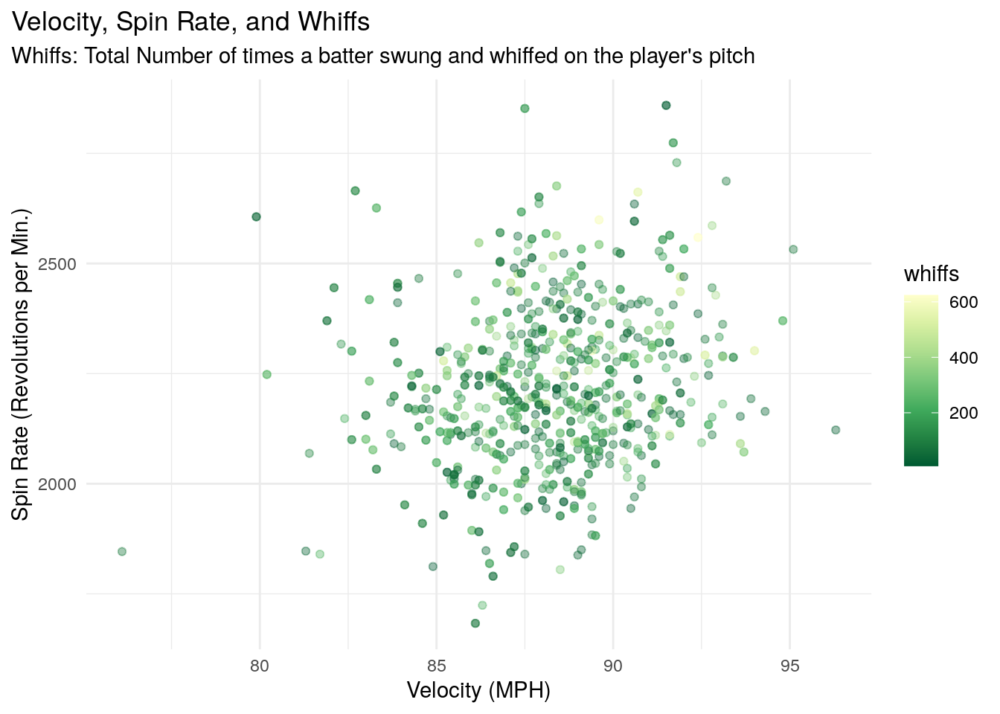
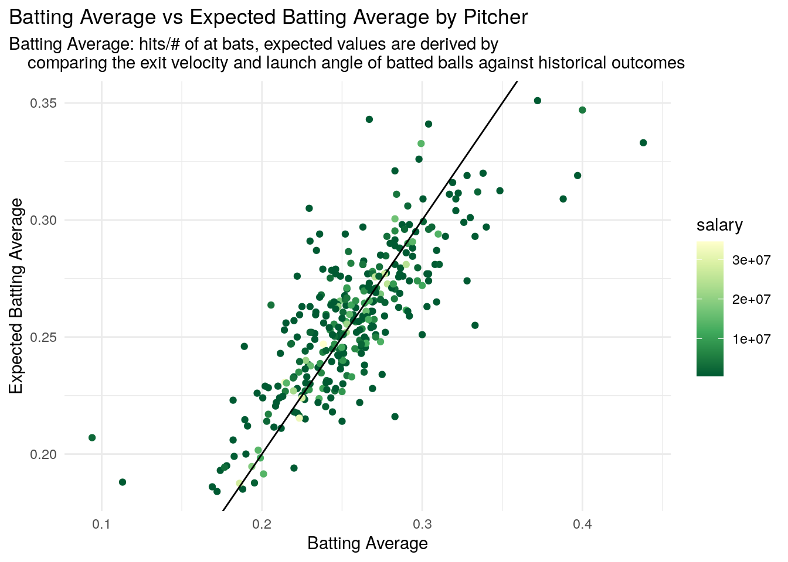

<!-- README.md is generated from README.Rmd. Please edit that file -->

<!-- You'll still need to render `README.Rmd` regularly, to keep `README.md` up-to-date. `devtools::build_readme()` is handy for this.  -->

# pitchR 

<!-- badges: start -->

<!-- badges: end -->

The goal of pitchR is to create an accessible dataset with advanced
pitcher statistics by season and their corresponding salaries. This
dataset contains statistics from the 2018 thru 2020 seasons.

## Installation

The development version of XXX is available from
[GitHub](https://github.com/) with:

``` r
# install.packages("devtools")
devtools::install_github("Reed-Math241/pkgDemo")
```

## About the Data

Data were collected and made available by
[Spotrac](https://www.spotrac.com/mlb/payroll/) and the
[Savant](https://baseballsavant.mlb.com/statcast_search).

The pitchR package contains one dataset, with data on Pitchers from the
2018-2020 Seasons.

``` r
library(pitchR)
data(package = 'pitchR')
```

Here is a simplified version of the raw data; see `?pitchR` for more
info:

``` r
head(pitchR)
#>              name   salary pitches player_id year    ba   iso babip   slg  woba
#> 1 Clayton Kershaw 35571428    2364    477132 2018 0.227 0.139 0.276 0.366 0.272
#> 2       Rich Hill 16666666    2104    448179 2018 0.219 0.181 0.272 0.400 0.297
#> 3     Kenta Maeda  6125000    2051    628317 2018 0.240 0.159 0.323 0.399 0.304
#> 4       Alex Wood  6000000    2443    622072 2018 0.247 0.116 0.295 0.363 0.288
#> 5  Ross Stripling   555000    1999    548389 2018 0.257 0.174 0.324 0.431 0.309
#> 6 Masahiro Tanaka 22000000    2398    547888 2018 0.240 0.182 0.286 0.422 0.307
#>   xwoba   xba hits abs launch_speed launch_angle spin_rate velocity
#> 1 0.285 0.240  139 612         88.0          9.4      2456     86.7
#> 2 0.309 0.229  108 493         88.8         15.7      2626     83.3
#> 3 0.292 0.225  115 479         87.3         13.6      2261     86.8
#> 4 0.295 0.244  143 579         88.1          8.6      1894     86.0
#> 5 0.272 0.223  123 478         87.9         10.3      2313     87.2
#> 6 0.311 0.247  141 588         88.9         10.7      2031     86.7
#>   effective_speed whiffs swings takes release_extension
#> 1           86.65    277   1208  1142              6.20
#> 2           82.68    244    988  1104              6.04
#> 3           86.13    322   1016  1022              5.85
#> 4           85.66    283   1187  1239              6.07
#> 5           86.53    244    952  1033              5.75
#> 6           85.49    356   1207  1182              5.56
```

## Example

You can find these and more code examples for exploring pitchR in
`vignette("examples")`.

Pitchers are fun to summarize\! For example:

``` r
library(tidyverse)
pitchR %>% 
  count(year)
#> # A tibble: 3 x 2
#>    year     n
#>   <dbl> <int>
#> 1  2018   318
#> 2  2019   276
#> 3  2020   238
pitchR %>% 
  group_by(year) %>% 
  summarize(across(where(is.numeric), mean, na.rm = TRUE))
#> # A tibble: 3 x 22
#>    year salary pitches player_id    ba   iso babip   slg  woba xwoba   xba  hits
#>   <dbl>  <dbl>   <dbl>     <dbl> <dbl> <dbl> <dbl> <dbl> <dbl> <dbl> <dbl> <dbl>
#> 1  2018 6.50e6   1867.   548950. 0.254 0.171 0.294 0.426 0.324 0.332 0.255 107. 
#> 2  2019 7.23e6   2015.   562533. 0.257 0.189 0.301 0.447 0.324 0.330 0.257 118. 
#> 3  2020 6.87e6    786.   579673. 0.245 0.175 0.288 0.420 0.312 0.312 0.250  43.8
#> # … with 10 more variables: abs <dbl>, launch_speed <dbl>, launch_angle <dbl>,
#> #   spin_rate <dbl>, velocity <dbl>, effective_speed <dbl>, whiffs <dbl>,
#> #   swings <dbl>, takes <dbl>, release_extension <dbl>
```

Pitchers are fun to visualize\! For example:



