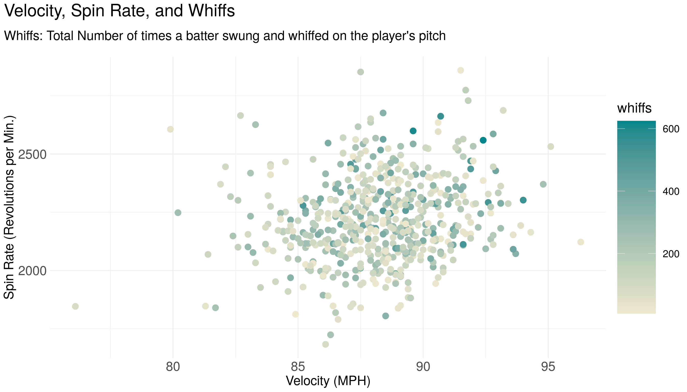

<!-- README.md is generated from README.Rmd. Please edit that file -->

# pitchR 

<!-- badges: start -->

<!-- badges: end -->

The goal of pitchR is to create an accessible dataset with advanced
pitcher statistics by season and their corresponding salaries. This
dataset contains statistics from the 2018, 2019, and 2020 seasons.

## Installation

The development version of pitchR is available from
[GitHub](https://github.com/) with:

``` r
# install.packages("devtools")
devtools::install_github("Reed-Math241/pkgDemo")
```

## About the Data

Data were collected and made available by
[Spotrac](https://www.spotrac.com/mlb/payroll/) and the
[Savant](https://baseballsavant.mlb.com/statcast_search).

The pitchR package contains one dataset, with data on Pitchers from the
2018-2020 Seasons.

``` r
library(pitchR)
data('pitchR')
```

Here is a simplified version of the raw data; see `?pitchR` for more
info:

``` r
head(pitchR)
#> # A tibble: 6 x 23
#>   name  salary pitches player_id  year    ba   iso babip   slg  woba xwoba   xba
#>   <chr>  <dbl>   <dbl>     <dbl> <dbl> <dbl> <dbl> <dbl> <dbl> <dbl> <dbl> <dbl>
#> 1 Clay… 3.56e7    2364    477132  2018 0.227 0.139 0.276 0.366 0.272 0.285 0.24 
#> 2 Rich… 1.67e7    2104    448179  2018 0.219 0.181 0.272 0.4   0.297 0.309 0.229
#> 3 Kent… 6.12e6    2051    628317  2018 0.24  0.159 0.323 0.399 0.304 0.292 0.225
#> 4 Alex… 6.00e6    2443    622072  2018 0.247 0.116 0.295 0.363 0.288 0.295 0.244
#> 5 Ross… 5.55e5    1999    548389  2018 0.257 0.174 0.324 0.431 0.309 0.272 0.223
#> 6 Masa… 2.20e7    2398    547888  2018 0.24  0.182 0.286 0.422 0.307 0.311 0.247
#> # … with 11 more variables: hits <dbl>, abs <dbl>, launch_speed <dbl>,
#> #   launch_angle <dbl>, spin_rate <dbl>, velocity <dbl>, effective_speed <dbl>,
#> #   whiffs <dbl>, swings <dbl>, takes <dbl>, release_extension <dbl>
```

## Examples

Pitchers are fun to summarize\! For example:

``` r
library(tidyverse)

pitchR %>% 
  count(year)
#> # A tibble: 3 x 2
#>    year     n
#>   <dbl> <int>
#> 1  2018   318
#> 2  2019   276
#> 3  2020   238

pitchR %>% 
  group_by(year) %>% 
  summarize(across(where(is.numeric), mean, na.rm = T))
#> # A tibble: 3 x 22
#>    year salary pitches player_id    ba   iso babip   slg  woba xwoba   xba  hits
#>   <dbl>  <dbl>   <dbl>     <dbl> <dbl> <dbl> <dbl> <dbl> <dbl> <dbl> <dbl> <dbl>
#> 1  2018 6.50e6   1867.   548950. 0.254 0.171 0.294 0.426 0.324 0.332 0.255 107. 
#> 2  2019 7.23e6   2015.   562533. 0.257 0.189 0.301 0.447 0.324 0.330 0.257 118. 
#> 3  2020 6.87e6    786.   579673. 0.245 0.175 0.288 0.420 0.312 0.312 0.250  43.8
#> # … with 10 more variables: abs <dbl>, launch_speed <dbl>, launch_angle <dbl>,
#> #   spin_rate <dbl>, velocity <dbl>, effective_speed <dbl>, whiffs <dbl>,
#> #   swings <dbl>, takes <dbl>, release_extension <dbl>
```

Pitchers are fun to visualize\! For example:




