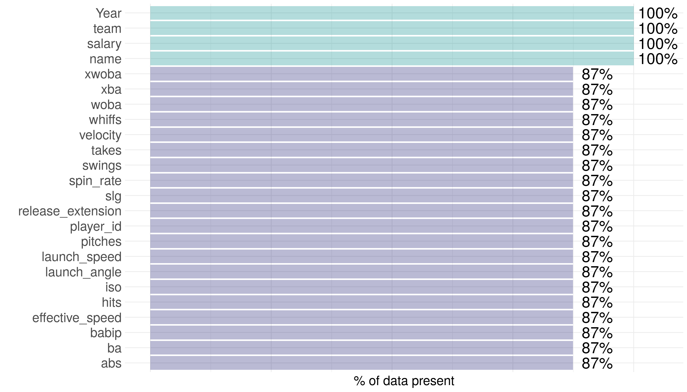
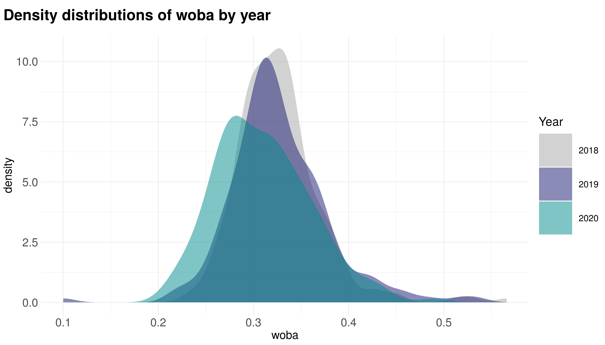

<!-- README.md is generated from README.Rmd. Please edit that file -->

# pitchR 

<!-- badges: start -->

<!-- badges: end -->

The goal of `pitchR` is to provide an accessible dataset with advanced
pitching statistics and salary data for individual starting pitchers.
This dataset contains data from the 2018, 2019, and 2020 seasons.

One exciting feature of the package is the inclusion of expected
statistics\!


## Installation

The development version of `pitchR` is available from
[GitHub](https://github.com/Reed-Math241/pkgGrpq) with:

``` r
# install.packages("devtools")
devtools::install_github("Reed-Math241/pkgDemo")
```

## About the Data

Data were collected and made available by
[Spotrac](https://www.spotrac.com/mlb/payroll/) and the
[Savant](https://baseballsavant.mlb.com/statcast_search). The full
scraping and cleaning process is documented
[here](https://github.com/Reed-Math241/pkgGrpq/blob/master/data-raw/DATASET.R).

The `pitchR` package contains one dataset, with 23 variables and 579
observations.

``` r
library(pitchR)
data('pitchR')
```

Here is a simplified version of the raw data; see `?pitchR` for more
information:

``` r
head(pitchR)
#> # A tibble: 6 x 23
#>   name  salary pitches player_id  year    ba   iso babip   slg  woba xwoba   xba
#>   <chr>  <dbl>   <dbl>     <dbl> <dbl> <dbl> <dbl> <dbl> <dbl> <dbl> <dbl> <dbl>
#> 1 clay… 3.56e7    2364    477132  2018 0.227 0.139 0.276 0.366 0.272 0.285 0.24 
#> 2 rich… 1.67e7    2104    448179  2018 0.219 0.181 0.272 0.4   0.297 0.309 0.229
#> 3 hyun… 7.83e6    1238    547943  2018 0.221 0.14  0.282 0.362 0.268 0.278 0.228
#> 4 kent… 6.12e6    2051    628317  2018 0.24  0.159 0.323 0.399 0.304 0.292 0.225
#> 5 alex… 6.00e6    2443    622072  2018 0.247 0.116 0.295 0.363 0.288 0.295 0.244
#> 6 ross… 5.55e5    1999    548389  2018 0.257 0.174 0.324 0.431 0.309 0.272 0.223
#> # … with 11 more variables: hits <dbl>, abs <dbl>, launch_speed <dbl>,
#> #   launch_angle <dbl>, spin_rate <dbl>, velocity <dbl>, effective_speed <dbl>,
#> #   whiffs <dbl>, swings <dbl>, takes <dbl>, release_extension <dbl>
```



## Examples

By virtue of `pitchR` having data from 3 different years, there is a lot
of summarizing and comparing the data that can be done. For example:

``` r
library(tidyverse)

pitchR %>% 
  count(year)
#> # A tibble: 4 x 2
#>    year     n
#>   <dbl> <int>
#> 1  2018   229
#> 2  2019   187
#> 3  2020   163
#> 4    NA    83

pitchR %>% 
  group_by(year) %>% 
  summarize(across(where(is.numeric), mean, na.rm = T))
#> # A tibble: 4 x 22
#>    year salary pitches player_id      ba     iso   babip     slg    woba   xwoba
#>   <dbl>  <dbl>   <dbl>     <dbl>   <dbl>   <dbl>   <dbl>   <dbl>   <dbl>   <dbl>
#> 1  2018 4.79e6   1716.   563538.   0.255   0.173   0.294   0.428   0.327   0.333
#> 2  2019 5.62e6   1906.   576284.   0.259   0.192   0.301   0.451   0.327   0.332
#> 3  2020 5.31e6    759.   595009.   0.242   0.173   0.284   0.416   0.310   0.312
#> 4    NA 4.26e6    NaN       NaN  NaN     NaN     NaN     NaN     NaN     NaN    
#> # … with 12 more variables: xba <dbl>, hits <dbl>, abs <dbl>,
#> #   launch_speed <dbl>, launch_angle <dbl>, spin_rate <dbl>, velocity <dbl>,
#> #   effective_speed <dbl>, whiffs <dbl>, swings <dbl>, takes <dbl>,
#> #   release_extension <dbl>
```

We can visualize distributions by year\!


